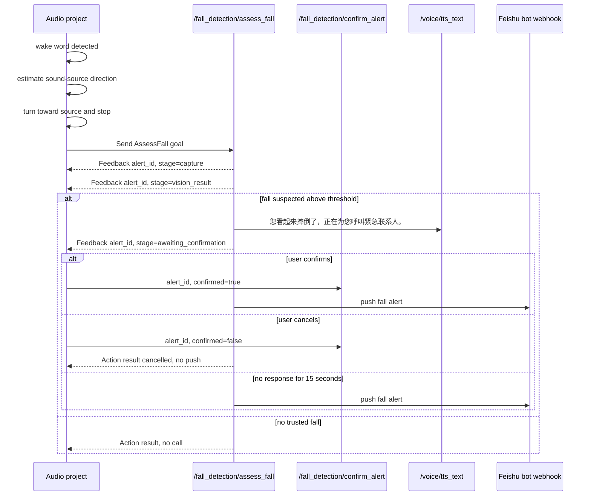

# Voice Fall Detection Integration

This document is the contract for the audio project to trigger the Project LINK
fall-response module after wake-word detection and sound-source steering.

## Boundary

- The audio project owns wake-word detection, sound-source localization, and any
  controlled turn toward the speaker.
- `project_link_fall_response` never publishes `/cmd_vel`, never moves the base,
  and never controls the arm.
- The audio project should call the fall Action only after the robot has turned
  toward the source and is stable.
- The fall module uses the second camera device, default `/dev/FallCam`. It does
  not share the visual-grasp camera at `/dev/RgbCam`.
- A suspected fall causes the fall module to publish the fixed Chinese TTS text
  on `/voice/tts_text`, then wait 15 seconds for confirmation or cancellation.
  If no valid response arrives within 15 seconds, it automatically pushes a
  Feishu bot alert to the configured chat.

## Startup

Start the local TTS bridge and fall-response nodes:

```bash
source /home/wte/wheeltec_robot/scripts/project_link_env.sh
ros2 launch project_link_voice voice_direct_drive.launch.py enable_motion:=false
ros2 launch project_link_fall_response fall_response.launch.py camera_device:=/dev/FallCam
```

The launch file starts:

- `fall_camera_node`: provides `/fall_detection/capture_still`
- `fall_response_node`: provides `/fall_detection/assess_fall` and
  `/fall_detection/confirm_alert`

Required environment variables for a real Feishu push:

```bash
export SILICONFLOW_API_KEY=...
export FEISHU_BOT_WEBHOOK=https://open.feishu.cn/open-apis/bot/v2/hook/...
# Optional, only if signature verification is enabled in the bot security settings.
export FEISHU_BOT_SECRET=...
export FEISHU_BOT_ALERT_TITLE="Project LINK 跌倒告警"
export FEISHU_BOT_TIMEOUT_SEC=5
```

If `FEISHU_BOT_WEBHOOK` is missing, the module fails closed and does not send a
notification. Do not commit webhook URLs or signing secrets.

Feishu setup:

1. In the target Feishu group, add a custom bot.
2. Copy the bot webhook URL into `FEISHU_BOT_WEBHOOK`.
3. In security settings, enable signature verification if desired and copy the
   secret into `FEISHU_BOT_SECRET`.
4. Test with the CLI Action below before connecting the audio-side trigger.

## Trigger Flow



## Action: `/fall_detection/assess_fall`

Type: `project_link_emergency_interfaces/action/AssessFall`

Goal fields:

| Field | Type | Description |
| --- | --- | --- |
| `request_id` | `string` | Optional audio-side correlation ID. |
| `context` | `string` | Optional text such as wake phrase or source direction. |

Feedback fields:

| Field | Type | Description |
| --- | --- | --- |
| `alert_id` | `string` | Fall-module alert ID. Save this for confirmation. |
| `stage` | `string` | `capture`, `vision_request`, `vision_result`, `awaiting_confirmation`, `confirmation_timeout`, or `notification_finished`. |
| `confidence` | `float32` | Vision confidence from 0.0 to 1.0 when available. |
| `message` | `string` | Human-readable status or model reason. |

Result fields:

| Field | Type | Description |
| --- | --- | --- |
| `fall_suspected` | `bool` | Model returned a suspected fall. |
| `confidence` | `float32` | Parsed model confidence. |
| `reason` | `string` | Parsed model reason. |
| `alert_started` | `bool` | TTS and confirmation window were entered. |
| `alert_id` | `string` | Alert ID used for confirmation. |
| `notification_attempted` | `bool` | Feishu bot webhook was invoked. |
| `notification_success` | `bool` | Feishu accepted the message. |
| `message` | `string` | Final status or failure reason. |

Only one Action goal can be active. A second goal is rejected until the first one
finishes or is cancelled.

CLI smoke test:

```bash
ros2 action send_goal /fall_detection/assess_fall \
  project_link_emergency_interfaces/action/AssessFall \
  "{request_id: cli-test, context: manual test}" --feedback
```

## Service: `/fall_detection/confirm_alert`

Type: `project_link_emergency_interfaces/srv/ConfirmFallAlert`

Request fields:

| Field | Type | Description |
| --- | --- | --- |
| `alert_id` | `string` | The current feedback `alert_id`. Unknown or expired IDs are rejected. |
| `confirmed` | `bool` | `true` calls now; `false` cancels and prevents calling. |

Response fields:

| Field | Type | Description |
| --- | --- | --- |
| `success` | `bool` | `true` if the alert ID was accepted. |
| `message` | `string` | Confirmation, cancellation, or rejection reason. |

CLI examples:

```bash
ros2 service call /fall_detection/confirm_alert \
  project_link_emergency_interfaces/srv/ConfirmFallAlert \
  "{alert_id: '<feedback-alert-id>', confirmed: true}"

ros2 service call /fall_detection/confirm_alert \
  project_link_emergency_interfaces/srv/ConfirmFallAlert \
  "{alert_id: '<feedback-alert-id>', confirmed: false}"
```

## Audio-Side Requirements

- On wake word: localize source direction, turn toward it using the audio
  project's own controlled motion path, and wait until the base is stopped.
- Send one `AssessFall` goal and listen for feedback.
- Store the first non-empty `alert_id`.
- Treat phrases such as `确认通知`, `确认`, or equivalent as `confirmed=true`.
- Treat phrases such as `取消通知`, `停止`, or `取消` as `confirmed=false`; also
  cancel the Action goal if it is still running.
- If the Action result reports `notification_success=false`, announce/log the
  failure but do not retry automatically.
- Keep a physical emergency stop or power-cut procedure available during any
  test that combines source-direction turning with real hardware.
