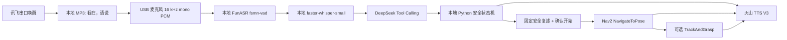
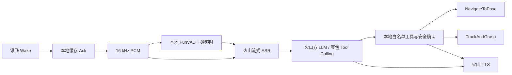

# Project LINK 火山引擎端到端语音迁移交接

更新时间：2026-08-11
适用仓库：`Project_LINK_ROS2`
本地工作区：`C:\Users\XWen1024\Documents\ROS2小车`
Orin 工作区：`/home/wte/wheeltec_robot`
Orin 登录：`wte@orin`
当前 Git 提交：`9a9fd33 Shut down Volcano TTS worker cleanly`

## 0. 2026-08-12 Embedded Kit S2S 接入更新

独立分支：`codex/volc-s2s-voice-integration`

独立 Windows worktree：

```text
C:\Users\XWen1024\Documents\ROS2小车-volc-voice
```

建议 Orin 独立 worktree：

```text
/home/wte/wheeltec_robot-volc-voice
```

新增纯语音路径：

```text
讯飞本地唤醒
-> 本地缓存“我在，请说”
-> XFM USB 麦克风 16 kHz mono
-> 原始 PCM 持续上传（本地不做 VAD/ASR）
-> 持久 native volc_ws_bridge
-> 官方 Embedded Kit low-load WebSocket S2S + server_vad
-> native PCM callback
-> Python 有界播放队列
-> USB 扬声器
```

首版刻意不接运动控制：

- 不启动底盘；
- 不发布 `/cmd_vel`；
- 不调用 Nav2；
- 不调用机械臂；
- 仅验证长连接纯语音和真实体感延迟。

### 构建

```bash
cd /home/wte/wheeltec_robot-volc-voice
git submodule update --init --recursive

cd experiments/volc_s2s_smoke
./scripts/build.sh

cd /home/wte/wheeltec_robot-volc-voice
source /opt/ros/humble/setup.bash
colcon build --packages-up-to project_link_voice
```

### 2026-08-12 Orin 首次集成实测

专用 Orin worktree 已切到跟踪分支
`codex/volc-s2s-voice-integration`。本轮没有修改或启动原始业务链路。

已验证：

- native `volc_ws_bridge` 在 Orin 原生 ARM64 重编译通过，`file` 确认
  `ELF 64-bit ... ARM aarch64`；RTC 仍关闭且未链接；
- `project_link_voice_interfaces`、`wheeltec_robot_msg`、
  `project_link_voice` 按依赖顺序构建通过；
- bridge、timing logger、FunVAD、唤醒解析定向测试为 `15 passed`；
- Embedded Kit 动态设备注册成功，耗时 `857 ms`；
- low-load WSS 原生连接成功，耗时 `465 ms`；
- 从启动 trace 到 connected 共 `1329.106 ms`；
- 服务端返回实际模型 `doubao-seed-2-1-turbo-260628`、PCM16 输入输出和
  `server_vad`；
- S2S 新路径已取消 FunVAD 加载和推理；Legacy 路径仍保留 FunVAD；
- PyAudio 已成功打开 16 kHz 单声道 Pulse 播放流；
- ROS graph 中持续存在 `/volc_s2s_voice_node` 和 `/voice_s2s/status`。

本轮尚不能完成真实唤醒/麦克风/扬声器闭环，因为检查时 Orin USB 总线上没有
枚举讯飞唤醒串口、XFM USB 麦克风或 C-Media USB 扬声器。`/dev/serial/by-id`
为空，ALSA/Pulse 只看到 Jetson 板载音频。接回三项设备后必须重新运行
`--scan-only`，以实际扫描结果选择 PyAudio index，不能沿用断开设备时的编号。

本轮发现并修复了两个部署问题：ROS/colcon `setup.bash` 与 `set -u` 的兼容性，
以及 `.env.local` 变量只成为 shell 变量、未 export 给 Python/native 子进程的
问题。凭证检查只输出 `set/missing`，不会打印值。

### 凭证

默认从以下文件加载 Embedded Kit 凭证：

```text
/home/wte/wheeltec_robot-volc-voice/experiments/volc_s2s_smoke/.env.local
```

需要：

```text
VOLC_BOT_ID
VOLC_INSTANCE_ID
VOLC_PRODUCT_KEY
VOLC_PRODUCT_SECRET
VOLC_DEVICE_NAME
```

不得打印或提交变量值。

### 启动纯语音长连接

先停止所有占用讯飞唤醒串口或麦克风的 Legacy 语音 tmux，再运行：

```bash
cd /home/wte/wheeltec_robot-volc-voice
./scripts/start_volc_s2s_voice.sh --restart --no-attach
tmux attach -t project_link_volc_s2s_voice
```

如果只想先检查设备和变量名是否齐全：

```bash
./scripts/start_volc_s2s_voice.sh --scan-only
```

键盘唤醒测试：

```bash
./scripts/start_volc_s2s_voice.sh --restart --keyboard-wakeup
```

### 新增 timing phase

同一次人工交互沿用一个 `trace_id`。关键 phase：

```text
volc_device_registration
volc_ws_connect
wakeup_ack_playback
wakeup_ack_to_first_input_audio
raw_pcm_capture
volc_wakeup_to_first_input_audio
volc_first_input_to_speech_started
volc_last_input_to_speech_stopped
volc_last_input_to_server_commit
volc_commit_to_server_ack（云端自动 committed；最长录音保护触发时除外）
volc_last_input_to_response_created
volc_vad_stop_to_function_call
volc_last_input_to_function_call
volc_function_call_to_arguments_done
volc_last_input_to_first_ai_audio
volc_vad_stop_to_first_ai_audio
volc_wakeup_to_first_ai_audio
volc_audio_callback_to_speaker_write
volc_last_input_to_speaker_write
volc_wakeup_to_speaker_write
volc_first_audio_to_audio_done
volc_last_input_to_response_done
speaker_playback_drain
```

这里的 `speaker_write` 是进入 PyAudio `stream.write()` 的时间，不是扬声器
物理振膜真正发出第一采样的硬件测量。它比“收到网络音频”更接近用户体感，
但仍可能包含 ALSA/PulseAudio 缓冲误差。

日志：

```text
~/.ros/project_link_voice/voice_debug.jsonl
~/.ros/project_link_voice/voice_timing.jsonl
```

### 关键实现

```text
experiments/volc_s2s_smoke/src/bridge.c
src/project_link_voice/project_link_voice/volc_s2s_bridge.py
src/project_link_voice/project_link_voice/volc_s2s_voice_node.py
src/project_link_voice/launch/volc_s2s_voice.launch.py
src/project_link_voice/config/volc_s2s_voice.yaml
scripts/start_volc_s2s_voice.sh
```

native helper 是长生命周期进程。Python 通过继承的 Unix `socketpair` 发送
PCM/commit/interrupt，并接收服务端 JSON 与 PCM。SDK 的 callback 不直接做
扬声器 I/O，避免阻塞 WebSocket 接收线程。

### 回滚

停止 S2S：

```bash
tmux kill-session -t project_link_volc_s2s_voice
```

恢复 Legacy 演示：

```bash
cd /home/wte/wheeltec_robot
bash scripts/start_llm_voice_car_demo.sh \
  --restart --wakeup-port auto --audio-input-index 0 --no-attach
```

禁止同时启动两套语音节点，因为它们会竞争同一个讯飞唤醒串口和麦克风。

## 1. 文档目的

本文档用于把 Project LINK 当前语音、底盘导航和视觉抓取链路交接给负责
字节跳动火山引擎端到端迁移的工程师。

这里的“端到端迁移”建议理解为：

```text
讯飞本地唤醒
-> 本地录音端点与安全超时
-> 火山引擎 ASR
-> 火山方大模型 / 豆包 Tool Calling
-> 本地 Python 安全执行层
-> Nav2 / 视觉抓取
-> 火山引擎 TTS
```

不建议在第一阶段把机器人运动控制交给不可审计的纯 Speech-to-Speech
黑盒。机器人运动、抓取、确认和取消必须继续由本地 Python/ROS 2 状态机
执行；云端只负责语音识别、语言理解、工具选择和语音合成。

## 2. 当前结论

- 当前活动服务是无地图演示模式：`project_link_llm_voice_car_demo`。
- 讯飞唤醒、USB 麦克风、DeepSeek Tool Calling、火山 TTS、有限时长
  `/cmd_vel` 演示动作已经真实跑通。
- 生产语音节点已实现 Nav2 `NavigateToPose` 后端、命名航点、二次确认、
  取消优先、到达后可选 `TrackAndGrasp`。
- Nav2 语音节点已在 Orin 做过无运动 dry-run：状态显示
  `backend=nav2`，且 `voice_dialog_node` 创建的 `/cmd_vel` 发布者数量为 0。
- 尚未完成“真实语音 -> Nav2 实车到点 -> SO-101 抓取”的现场全链路验收。
- 当前 ASR 不是火山引擎：使用本地 `faster-whisper-small`。
- 当前 VAD 不是火山引擎：使用本地 FunASR `fsmn-vad`。
- 当前 LLM 不是火山引擎：使用 DeepSeek 官方 OpenAI 兼容 API，模型
  `deepseek-v4-flash`。
- 当前 TTS 已经是火山引擎 V3 双向 WebSocket TTS 2.0。
- 固定唤醒回复“我在，请说。”已经生成本地 MP3，唤醒后本地同步播放，
  播放结束才开始 FunVAD 录音。

## 3. 当前部署快照

### 3.1 Git 与构建

```text
GitHub/main: 9a9fd33
Orin/main:   9a9fd33
```

当前 Orin 源码和 `install/project_link_voice` 中的 `volcano_tts.py` 哈希一致。
当前活动演示进程启动时间早于 `9a9fd33`，因此下一次重启后才会在进程内
应用最新的 TTS worker 清理逻辑。

Orin 最新定向测试：

```text
21 passed in 0.12s
```

覆盖：

- LLM Tool Calling 客户端；
- 串口唤醒分片匹配；
- FunVAD 端点状态机；
- 火山 TTS 帧协议；
- debug/timing JSONL。

### 3.2 当前 tmux

```text
project_link_llm_voice_car_demo
```

该会话通常包含：

- `voice`：LLM 语音演示节点；
- `base`：C63A 底盘串口节点；
- `test`：文本话题测试窗口。

当前没有运行 `project_link_voice_nav2` 生产会话。

### 3.3 Orin 未跟踪运行文件

Orin 仓库根目录存在：

```text
.data
.posegraph
```

这是运行期文件，不要删除、不要提交。

Windows 本地工作区还有大量机械臂、VL53L0X 和文档的未提交改动。
迁移开发禁止使用 `git add .`；必须精确暂存语音相关文件。

## 4. 硬件与设备

### 4.1 讯飞唤醒与麦克风

讯飞麦克风主板：

```text
USB ID: 2207:0001
产品名: XFM-DP-V0.0.18
```

PulseAudio 输入：

```text
alsa_input.usb-iflytek_XFM-DP-V0.0.18_6c00144060144991f50-01.mono-fallback
s16le / 1 channel / 16000 Hz
```

PyAudio 当前输入索引：

```text
0: XFM-DP-V0.0.18: USB Audio (hw:0,0)
```

讯飞唤醒串口稳定路径：

```text
/dev/serial/by-id/usb-WCH.CN_USB_Single_Serial_0004-if00
-> /dev/ttyACM3
```

区分讯飞设备时以 USB Serial `0004` 为准，不要只看 VID/PID。

### 4.2 USB 扬声器

当前 PulseAudio 输出：

```text
alsa_output.usb-C-Media_Electronics_Inc._USB_Audio_Device-00.analog-stereo
s16le / 2 channels / 48000 Hz
```

当前为 Pulse sink `0`，状态 `RUNNING`。

USB 声卡枚举号可能变化。生产逻辑应优先使用稳定 Pulse sink 名称或
udev/音频配置，不要把 PyAudio 输出索引当成永久标识。

### 4.3 底盘

```text
/dev/wheeltec_controller
-> /dev/ttyACM0
baud: 115200
```

生产 Nav2 模式下，语音节点不发布 `/cmd_vel`。Nav2 的
`velocity_smoother` 和 `behavior_server` 是允许的速度发布者。

## 5. 当前软件数据流



### 5.1 唤醒

代码：

```text
src/project_link_voice/project_link_voice/wakeup.py
```

当前行为：

- 自动选择 USB Serial 为 `0004` 的讯飞串口；
- 不再依赖 `readline()`；
- 通过滚动二进制缓冲匹配可能跨 USB 分片的 `aiui_event`；
- 默认关闭逐字节原始串口打印，避免日志和调度抖动；
- Python 只能避免丢失已经发送出来的 AIUI 事件，无法提高讯飞板本身的
  声学唤醒命中率。

如果迁移后仍有低唤醒率，应另外检查：

- 唤醒词模型和阈值；
- 麦克风阵列方向；
- 板载降噪与回声消除；
- 喇叭与麦克风物理距离；
- 机器人电机、风扇噪声；
- 讯飞固件输出的 score、power、angle。

### 5.2 唤醒回复缓存

缓存文件：

```text
/home/wte/.cache/project_link_voice/wakeup_ack.mp3
```

已验证格式：

```text
MPEG Layer III / 64 kbps / 24 kHz / mono
```

当前行为：

1. 服务启动时检查 MP3 是否存在；
2. 不存在时通过火山 TTS 合成并原子写入；
3. 唤醒后使用 pygame 本地同步播放；
4. 播放完成后才打开麦克风并开始 FunVAD；
5. 本地文件不可用时回退到实时火山 TTS，并等待播放结束。

代码：

```text
src/project_link_voice/project_link_voice/volcano_tts.py
src/project_link_voice/project_link_voice/llm_motion_demo_node.py
src/project_link_voice/project_link_voice/voice_dialog_node.py
```

### 5.3 FunVAD

当前模型：FunASR `fsmn-vad`。

本地目录：

```text
/home/wte/.cache/modelscope/models/
  iic--speech_fsmn_vad_zh-cn-16k-common-pytorch/snapshots/master
```

环境变量：

```bash
export PROJECT_LINK_FUNVAD_MODEL=/home/wte/.cache/modelscope/models/\
iic--speech_fsmn_vad_zh-cn-16k-common-pytorch/snapshots/master
```

关键修复：

- 输入从 PCM bytes 转为归一化 `float32 ndarray`；
- 流式调用明确传入 `chunk_size=200`；
- 超时边界传入 `is_final=true`；
- 维护模型 cache 和预录缓冲；
- 无语音、最大单句、模型异常都有硬结束路径；
- 模型在接收唤醒事件前预热完成。

本地模型预热目前约 14 秒，主要是模型加载，不再依赖 ModelScope 网络。

### 5.4 ASR

当前 ASR：`faster-whisper-small`。

本地目录：

```text
/home/wte/.cache/project_link/models/faster-whisper-small
```

环境变量：

```bash
export PROJECT_LINK_WHISPER_MODEL=/home/wte/.cache/project_link/models/\
faster-whisper-small
```

配置：

```text
language: zh
device: cuda
compute_type: float16
fallback: cpu/int8
```

当前模式是在 FunVAD 输出完整 utterance 后一次性转写，不是实时增量 ASR。

### 5.5 LLM Tool Calling

当前配置：

```text
API: https://api.deepseek.com
Model: deepseek-v4-flash
SDK: OpenAI-compatible Python client
API key env: DEEPSEEK_API_KEY
```

工具定义位于：

```text
src/project_link_voice/project_link_voice/llm.py
```

白名单工具：

| 工具 | 作用 |
|---|---|
| `get_weather` | 查询天气；需要 `QWEATHER_API_KEY` |
| `get_current_location` | 读取 `map -> base_footprint` |
| `save_waypoint` | 保存当前位置为命名航点 |
| `navigate_to_location` | 创建待确认导航任务 |
| `fetch_item_from_location` | 创建“导航后抓取”待确认任务 |
| `list_saved_locations` | 列出命名航点 |
| `cancel_current_task` | 取消当前任务 |

LLM 只能选择工具和填写参数。它不能：

- 直接发布 `/cmd_vel`；
- 直接调用 Nav2 或机械臂 Action；
- 自由生成地图坐标；
- 绕过本地确认；
- 声称机器人已经到达或已经抓取。

### 5.6 本地 Python 安全状态机

代码：

```text
src/project_link_voice/project_link_voice/voice_dialog_node.py
```

生产导航流程：

```text
识别地点
-> 只匹配命名航点
-> 创建 PendingTask
-> 本地固定安全提示
-> 等待“确认开始/确认前往”
-> 检查 map/scan/odom/TF/Nav2 Action/cmd_vel 发布者
-> 发送 NavigateToPose
-> 到达后播报
-> 可选 connect_arm + set_torque(true) + TrackAndGrasp
```

“停止”“取消”在进入 LLM 之前本地优先处理：

- 清除待确认任务；
- 取消当前 Nav2 或直驱 Goal；
- 取消抓取 Goal；
- 请求 `/visual_grasp/stop`；
- 演示模式发布多帧零 `Twist`。

物理 E-stop 仍是唯一独立、立即的安全停止路径。

### 5.7 火山 TTS

代码：

```text
src/project_link_voice/project_link_voice/volcano_tts.py
src/project_link_voice/project_link_voice/tts_protocols.py
```

当前端点：

```text
wss://openspeech.bytedance.com/api/v3/tts/bidirection
```

当前认证 Header：

```text
X-Api-App-Key
X-Api-Access-Key
X-Api-Resource-Id
X-Api-Connect-Id
```

环境变量：

```text
VOLCANO_APP_ID
VOLCANO_ACCESS_TOKEN
VOLCANO_RESOURCE_ID
VOLCANO_SPEAKER
```

当前默认 Resource ID：

```text
seed-tts-2.0
```

实现支持：

- 完整文本独立 session；
- LLM 文本流式 feed；
- 事件 50/150/152/350/351/352；
- PCM 播放；
- 固定短语 MP3 文件合成；
- 内存短语缓存；
- first-audio 与 synthesis-complete timing；
- stop 和 shutdown worker 清理。

## 6. 当前 ROS 2 接口

### 6.1 语音话题

| 接口 | 类型 | 说明 |
|---|---|---|
| `/voice/text_input` | `std_msgs/String` | 生产语音节点文本测试入口 |
| `/voice/status` | `std_msgs/String` | idle/pending/executing、模式、后端、SLAM 状态 |
| `/voice/tts_text` | `std_msgs/String` | 对外广播 TTS 文本 |
| `/voice_demo/text_input` | `std_msgs/String` | 无地图演示文本入口 |
| `/voice_demo/status` | `std_msgs/String` | 演示状态 |

### 6.2 导航与抓取

| 接口 | 类型 | 说明 |
|---|---|---|
| `/navigate_to_pose` | `nav2_msgs/action/NavigateToPose` | 生产导航后端 |
| `/voice/drive_to_point` | `project_link_voice_interfaces/action/DriveToPoint` | 无规划直驱回退 |
| `/visual_grasp/track_and_grasp` | `wheeltec_robot_msg/action/TrackAndGrasp` | 视觉抓取 |
| `/visual_grasp/connect_arm` | `std_srvs/Trigger` | 连接机械臂 |
| `/visual_grasp/set_torque` | `std_srvs/SetBool` | 设置扭矩 |
| `/visual_grasp/stop` | `std_srvs/Trigger` | 停止视觉逼近/抓取 |

### 6.3 命名航点

运行文件：

```text
/home/wte/.ros/project_link_voice/waypoints.json
```

语音只接受文件中存在的名称。自由坐标必须拒绝。

现场保存：

```bash
cd /home/wte/wheeltec_robot
bash scripts/site_waypoints.sh save-current 客厅
bash scripts/site_waypoints.sh save-current 取药点
bash scripts/site_waypoints.sh list
```

第一次测试应在同一次地图会话中保存和使用航点，避免地图原点变化。

## 7. 当前运行模式

### 7.1 无地图 LLM 演示

```bash
cd /home/wte/wheeltec_robot
bash scripts/start_llm_voice_car_demo.sh \
  --restart --wakeup-port auto --audio-input-index 0 --no-attach
```

能力：

- 讯飞唤醒；
- FunVAD；
- faster-whisper；
- DeepSeek Tool Calling；
- 火山 TTS；
- 前进、后退、左转、右转、转圈、停止。

该模式是现场展示专用，不是生产导航。

### 7.2 Nav2 生产 dry-run

```bash
cd /home/wte/wheeltec_robot
bash scripts/start_voice_nav2_stack.sh --restart
```

脚本会先发送“停止”并关闭不兼容的 LLM 运动演示会话，然后启动
Navigation Two 和生产语音节点。默认不发送导航 Goal。

### 7.3 Nav2 生产运动

```bash
bash scripts/start_voice_nav2_stack.sh --restart --enable-motion
```

必须满足：

- Navigation Two 已健康；
- `/navigate_to_pose` 可用；
- `/map`、`/scan`、`/odom` 有实时数据；
- `map -> base_footprint` 连续；
- 没有键盘遥控；
- `/cmd_vel` 只有允许的 Nav2 发布者；
- 物理 E-stop 可用；
- 使用已保存航点；
- 用户明确说“确认开始”。

### 7.4 Nav2 + 抓取

```bash
bash scripts/start_voice_nav2_stack.sh --restart --with-visual \
  --enable-motion --enable-visual-grasp
```

机械臂必须先独立验收。语音抓取不能作为第一次 SO-101 上电测试。

### 7.5 直驱回退

```bash
ros2 launch project_link_voice voice_direct_drive.launch.py \
  enable_motion:=false
```

直驱无规划、无成本地图、无避障，仅保留为低速受监护回退，不应作为
火山迁移的主要生产目标。

## 8. 当前 API 与本地配置

凭证文件：

```text
/home/wte/.config/project_link/voice_api.env
```

权限建议：

```bash
chmod 600 /home/wte/.config/project_link/voice_api.env
```

当前仅确认以下变量存在，不在本文档记录任何值：

```text
DEEPSEEK_API_KEY
PROJECT_LINK_FUNVAD_MODEL
PROJECT_LINK_WHISPER_MODEL
VOLCANO_ACCESS_TOKEN
VOLCANO_APP_ID
VOLCANO_RESOURCE_ID
VOLCANO_SPEAKER
```

迁移期间禁止：

- 把密钥写入 Git；
- 在控制台完整打印 token；
- 在 debug JSONL 中写入 Authorization/Header；
- 把用户原始音频长期保存到仓库；
- 在 Pull Request 中提交真实 endpoint secret。

## 9. 当前性能基线

以下是 2026-08-11 两次成功音频工具调用的观测范围，不是统计意义上的
p95：

| 阶段 | 观测范围 |
|---|---:|
| FunVAD 录音 | 5.34–6.15 s，包含用户说话和尾部端点等待 |
| faster-whisper ASR | 3.36–3.72 s |
| DeepSeek API roundtrip | 1.50–1.97 s |
| LLM 总处理 | 1.62–2.08 s |
| Python demo tool | 102–109 ms |
| 火山 TTS first audio | 272–277 ms |
| 火山 TTS synthesis complete | 473–490 ms |
| 总链路 | 10.79–12.38 s |

固定唤醒 MP3 的目标是消除唤醒后等待云端 TTS 的不稳定反馈。代码已记录
`wakeup_ack_playback` timing，但最新 timing 文件中还没有一次人工唤醒后的
缓存播放样本；迁移前应补测。

当前主要延迟瓶颈：

1. 完整 utterance 结束后才运行 Whisper；
2. Whisper small 在 Orin 上单句约 3.5 秒；
3. LLM 请求约 1.5–2 秒；
4. VAD 尾部端点和用户停顿占总时长的大部分。

## 10. 日志与可观测性

```text
~/.ros/project_link_voice/voice_debug.jsonl
~/.ros/project_link_voice/voice_timing.jsonl
```

单次交互使用同一个 `trace_id`。

当前 timing phase 包括：

```text
wakeup_ack_playback
vad_record
asr
llm_api_roundtrip
llm_response_parse
llm_tool_arguments_parse
python_tool
llm_total
tts_dispatch
tts_first_audio
tts_synthesis_complete
```

迁移到火山全栈后必须保留这些 phase，并增加：

```text
volcano_asr_connect
volcano_asr_first_partial
volcano_asr_final
volcano_llm_request_id
volcano_llm_first_token
volcano_tts_connect
cloud_retry_backoff
```

日志必须记录 provider、model/endpoint ID、request ID、成功/失败和耗时，
但不能记录密钥。

## 11. 火山端到端迁移目标架构



### 11.1 必须保留的本地组件

- 讯飞唤醒或等价本地唤醒；
- 本地 MP3 即时反馈；
- FunVAD 或至少一个本地硬端点保护；
- 最大录音时长；
- 停止/取消本地关键词旁路；
- 命名航点校验；
- 二次确认；
- ROS Action/Service 执行；
- `/cmd_vel` 发布者检查；
- 物理 E-stop 流程；
- timing/debug 日志。

### 11.2 可以替换的 Provider

建议先抽象三个接口：

```python
class AsrProvider:
    def transcribe(self, pcm: bytes, sample_rate: int) -> AsrResult: ...

class LlmToolProvider:
    def chat(self, text, tool_handler, text_callback, timing_callback): ...

class TtsProvider:
    def speak(self, text, timing_callback=None): ...
    def speak_stream_start(self, timing_callback=None): ...
    def speak_stream_feed(self, text): ...
    def speak_stream_end(self): ...
    def stop(self): ...
```

ROS 节点只依赖这些接口，不应包含各家 API 的 Header、重试和协议解析。

### 11.3 不建议直接迁移的部分

如果火山提供端到端实时 Speech-to-Speech，第一阶段只能用于闲聊或 TTS
体验测试。只有满足以下条件后，才能参与运动指令：

- 能返回结构化、可审计 Tool Call；
- Tool Call 与当前 JSON schema 兼容；
- 支持 request ID 和完整日志；
- “停止/取消”仍由本地旁路；
- 最终运动仍要本地确认；
- 云端不能直接访问 ROS 2 网络。

## 12. 推荐迁移阶段

### 阶段 A：冻结基线

1. 保存当前 `voice_timing.jsonl`；
2. 录制安静、风扇、电机、远处人声和连续讲话停顿样本；
3. 保存当前 DeepSeek/Whisper/TTS 成功 trace；
4. 确认当前提交 `9a9fd33` 可回滚；
5. 不改 ROS 工具和安全状态机。

### 阶段 B：抽象 Provider

1. 提取 `AsrProvider`；
2. 提取 `LlmToolProvider`；
3. 让现有 faster-whisper 和 DeepSeek 成为 legacy provider；
4. 保持所有现有测试继续通过；
5. 增加 provider 参数，例如：

```text
asr_provider: faster_whisper | volcano
llm_provider: deepseek | volcano_ark
tts_provider: volcano
```

### 阶段 C：先迁移 LLM

DeepSeek 客户端已经使用 OpenAI 兼容接口，因此如果火山方 LLM/豆包接口
支持 OpenAI 兼容 Tool Calling，优先做这一项。

需要替换：

```text
base_url
api_key_env
model 或 endpoint_id
错误码与重试策略
streaming tool_call delta 解析
```

必须保持 `TOOL_SCHEMAS`、`ToolResult` 和本地工具处理器不变。

先在 shadow 模式同时请求 DeepSeek 和火山方 LLM，只记录两者工具选择，
不执行第二份结果。

### 阶段 D：迁移 ASR

第一版建议：

- 继续使用 FunVAD 截取完整 utterance；
- 将完整 16 kHz mono PCM 交给火山 ASR；
- 保留 faster-whisper 作为 shadow/回退；
- 比较文本、延迟、错误率和噪声鲁棒性。

第二版再做真正流式：

- 麦克风 chunk 同时送 FunVAD 与火山流式 ASR；
- FunVAD 决定本地录音硬结束；
- 火山 ASR partial 只用于 UI，不触发机器人动作；
- 只有 final transcript 才进入 Tool Calling；
- 云端没有 final 时由本地最大时长强制结束。

### 阶段 E：统一 TTS

当前 TTS 已经是火山 V3，可以直接保留。迁移任务主要是：

- 统一新火山账号/项目/Resource ID；
- 校验 speaker 权限；
- 保留 MP3 wake cache；
- 保留文本流式和完整文本两种模式；
- 增加限流、断线和重连指标；
- 验证 stop/shutdown 不残留 worker。

### 阶段 F：端到端 shadow

```text
真实唤醒
-> 火山 ASR
-> 火山 LLM Tool Calling
-> Python 只创建 dry-run pending task
-> 火山 TTS
```

这一阶段：

- `enable_motion=false`；
- `enable_visual_grasp=false`；
- 不发送 Nav2 Goal；
- 不启动机械臂；
- 对比当前 legacy provider timing。

### 阶段 G：Nav2 低速验收

1. 启动 Navigation Two；
2. 保存同一地图会话的近距离航点；
3. dry-run “去客厅 -> 确认开始”；
4. 检查工具、确认和状态；
5. 车轮悬空验证 Goal 和取消；
6. 有 E-stop 的空旷环境低速实车；
7. 验证“停止/取消”不依赖 LLM；
8. 验证云服务失败不会继续运动。

### 阶段 H：抓取验收

只在 Nav2 到点稳定、底盘停车和 SO-101 独立验收完成后启用。

```text
导航成功
-> connect_arm
-> set_torque(true)
-> TrackAndGrasp
-> TTS 成功/失败
```

## 13. 火山迁移方必须提供的信息

在编码前先锁定：

### 13.1 ASR

- 使用一句话、文件或流式 ASR；
- WebSocket/HTTP 端点；
- App ID、Access Token、Resource ID/Cluster 名称；
- PCM 编码、采样率、声道要求；
- partial/final 事件定义；
- endpoint/VAD 参数；
- 最大 session 时长；
- request ID 和错误码；
- QPS、并发和日配额；
- 数据保留与合规策略。

### 13.2 LLM / 豆包

- OpenAI 兼容 base URL；
- API key 环境变量名；
- model 名称或 endpoint ID；
- 是否支持 streaming Tool Calling；
- tool schema 限制；
- 并发和超时；
- 内容审核行为；
- request ID；
- 是否支持中国区 Orin 直连。

### 13.3 TTS

- 新项目的 App ID；
- Access Token；
- Resource ID；
- speaker；
- 是否继续使用 `seed-tts-2.0`；
- PCM/MP3 格式权限；
- 并发限制；
- 固定短语缓存是否允许长期本地保存。

不要在 handoff、Issue 或 Git 中填写真实值。

## 14. 环境变量建议

迁移后建议使用新的、明确的变量名，不复用含义模糊的旧变量：

```bash
export VOLCANO_ASR_APP_ID=
export VOLCANO_ASR_ACCESS_TOKEN=
export VOLCANO_ASR_RESOURCE_ID=
export VOLCANO_ASR_ENDPOINT=

export VOLCANO_ARK_API_KEY=
export VOLCANO_ARK_BASE_URL=
export VOLCANO_ARK_MODEL=
export VOLCANO_ARK_ENDPOINT_ID=

export VOLCANO_TTS_APP_ID=
export VOLCANO_TTS_ACCESS_TOKEN=
export VOLCANO_TTS_RESOURCE_ID=seed-tts-2.0
export VOLCANO_TTS_SPEAKER=
```

兼容期可以在加载脚本中把现有：

```text
VOLCANO_APP_ID
VOLCANO_ACCESS_TOKEN
VOLCANO_RESOURCE_ID
VOLCANO_SPEAKER
```

映射到新的 TTS 专用变量，但最终应去除歧义。

## 15. 验收指标

### 15.1 唤醒

- AIUI 事件已发出时，Python 不因 USB 分片丢事件；
- 本地提示首声稳定且不访问网络；
- 提示播放结束前不打开录音；
- 连续 30 次人工唤醒统计成功率；
- 记录 score/power/angle 与失败样本。

### 15.2 ASR

- 安静、风扇、电机噪声均可正确结束；
- 不无限录音；
- 不过早截断；
- 停止/取消词召回率优先于普通聊天准确率；
- 火山 ASR final 缺失时有本地硬超时；
- 与 faster-whisper 做同音频 shadow 对比。

建议目标：

```text
ASR final p50 < 1.5 s
ASR final p95 < 2.5 s
```

目标应根据所选火山 ASR 产品重新确认。

### 15.3 LLM

- 所有运动意图必须返回白名单工具；
- 闲聊不得误触运动工具；
- 不存在的航点不得执行；
- tool arguments 必须是合法 JSON；
- 单轮工具选择 p95 建议小于 2 秒；
- provider 超时后不得继续运动；
- shadow 差异必须可追踪到 request ID。

### 15.4 TTS

- 固定唤醒提示完全本地；
- 普通短句 first audio p95 建议小于 500 ms；
- 断网时不会阻塞 ROS executor；
- stop 后立即停止排队播放；
- shutdown 不残留线程或 pygame worker。

### 15.5 机器人安全

- 云端不能直接发布 `/cmd_vel`；
- Nav2 模式下 `voice_dialog_node` 的 `/cmd_vel` publisher 数量为 0；
- “停止/取消”绕过 LLM；
- 未确认不发送 Goal；
- 非命名航点拒绝；
- Nav2 失败不启动抓取；
- 取消/超时/异常均终止后续链路；
- 物理 E-stop 始终可用。

## 16. 已知问题与迁移风险

### 16.1 真实 Nav2 全链路尚未验收

代码和 dry-run 已通过，但还需要现场真实语音、真实航点和 Nav2 实车 Goal。

### 16.2 机械臂尚未完成现场验收

`TrackAndGrasp` 接口已接入，语音节点在接口未安装时不会拖死 Nav2，
但 SO-101 硬件、标定和抓取成功率仍需单独完成。

### 16.3 唤醒率不是纯软件问题

滚动缓冲修复的是串口分片丢事件；没有生成 AIUI wake event 时，必须调
讯飞固件、阵列方向和声学参数。

### 16.4 当前 ASR 延迟较高

Whisper small 单句约 3.5 秒，是迁移火山 ASR 后最有机会明显降低的部分。

### 16.5 音频设备枚举变化

麦克风当前 PyAudio index 为 0，但 USB 声卡重新插拔后输出枚举会改变。
生产应使用稳定设备名和 Pulse 默认 sink。

### 16.6 地图与航点生命周期

命名航点使用 `map` 坐标。地图重建或原点变化后旧 JSON 可能失效。
迁移云服务时不要顺带放宽成自由坐标控制。

### 16.7 云网络与代理

Orin 曾无法直连 Hugging Face；局域网代理
`http://192.168.3.166:7897` 可访问 Hugging Face。生产模型已经本地化，
正常运行不依赖该代理。

火山 ASR/LLM/TTS 必须分别测试 Orin 直连、DNS、IPv4、TLS 和超时，不要
假设 TTS 能连通就代表其他火山产品都能连通。

## 17. 关键文件

| 文件 | 作用 |
|---|---|
| `src/project_link_voice/project_link_voice/voice_dialog_node.py` | 生产语音与安全状态机 |
| `src/project_link_voice/project_link_voice/llm_motion_demo_node.py` | 无地图现场演示 |
| `src/project_link_voice/project_link_voice/funvad.py` | 本地流式端点检测 |
| `src/project_link_voice/project_link_voice/llm.py` | Tool schema、系统提示、DeepSeek 客户端 |
| `src/project_link_voice/project_link_voice/volcano_tts.py` | 火山 TTS 与 MP3 缓存 |
| `src/project_link_voice/project_link_voice/tts_protocols.py` | 火山 V3 帧协议 |
| `src/project_link_voice/project_link_voice/wakeup.py` | 串口分片匹配和自动设备选择 |
| `src/project_link_voice/project_link_voice/voice_debug.py` | trace/timing JSONL |
| `src/project_link_voice/project_link_voice/waypoints.py` | 命名航点与确认辅助 |
| `src/project_link_voice/launch/voice_nav2.launch.py` | Nav2 生产 launch |
| `src/project_link_voice/launch/voice_direct_drive.launch.py` | 直驱回退 launch |
| `src/project_link_voice/launch/llm_motion_demo.launch.py` | 无地图演示 launch |
| `src/project_link_voice/config/voice_direct_drive.yaml` | 共享参数 YAML |
| `scripts/start_voice_nav2_stack.sh` | Navigation Two + 生产语音一键入口 |
| `scripts/start_llm_voice_car_demo.sh` | 当前演示一键入口 |
| `scripts/site_waypoints.sh` | 航点保存和查看 |
| `docs/NAVIGATION_TWO_HANDOFF.md` | Nav2 详细交接 |
| `docs/VISUAL_GRASP_INTERFACE.md` | 抓取接口 |

## 18. 构建与测试

### 18.1 构建

```bash
ssh wte@orin
cd /home/wte/wheeltec_robot
source /opt/ros/humble/setup.bash
colcon build --packages-select wheeltec_robot_msg project_link_voice
source install/setup.bash
```

不要在当前 Orin 对这些包使用 `--symlink-install`，除非重新确认当前
setuptools/colcon 兼容性。

### 18.2 定向测试

```bash
cd /home/wte/wheeltec_robot
source /opt/ros/humble/setup.bash
source install/setup.bash
PYTHONPATH=src/project_link_voice python3 -m pytest \
  src/project_link_voice/test/test_llm_tools.py \
  src/project_link_voice/test/test_wakeup.py \
  src/project_link_voice/test/test_funvad.py \
  src/project_link_voice/test/test_tts_protocols.py \
  src/project_link_voice/test/test_voice_debug.py -q
```

### 18.3 脚本检查

```bash
bash -n scripts/start_llm_voice_car_demo.sh
bash -n scripts/start_voice_nav2_stack.sh
```

## 19. 迁移期间推荐测试指令

### 19.1 非运动

```text
你好
今天天气怎么样
有哪些保存的地点
当前位置在哪里
```

### 19.2 导航 dry-run

```text
去客厅
确认开始
取消
```

### 19.3 取消优先

```text
停止
取消任务
不要去了
```

### 19.4 抓取 dry-run

```text
去取药点拿药瓶
确认开始
取消
```

## 20. 回滚点

| Commit | 含义 |
|---|---|
| `9a9fd33` | 当前最新：TTS worker 清理 |
| `a254816` | Nav2 启动前停止演示 `/cmd_vel` 发布者 |
| `8753222` | Nav2 生产文档 |
| `4d32f14` | Nav2 与可选机械臂接口解耦 |
| `91bca65` | FunVAD 本地模型路径 |
| `532be28` | launch 字符串参数类型修复 |
| `010c42a` | 串口日志降噪 |
| `320d417` | Nav2 后端和 wake MP3 初版 |
| `273277c` | Nav2 迁移前的 Whisper 本地预热基线 |
| `00cdaa4` | FunVAD 正确流式输入与端点修复 |

如果火山迁移导致生产不可用，优先通过 provider 参数切回：

```text
ASR: faster-whisper
LLM: DeepSeek
TTS: 当前 Volcano V3
```

不要通过回退关闭确认、取消旁路或航点校验。

## 21. 交接清单

迁移负责人开始编码前应确认：

- [ ] 已阅读本文档；
- [ ] 已阅读 `docs/NAVIGATION_TWO_HANDOFF.md`；
- [ ] 已阅读 `docs/VISUAL_GRASP_INTERFACE.md`；
- [ ] 已拿到火山 ASR 产品与协议选择；
- [ ] 已拿到火山 LLM/豆包 endpoint ID 和 Tool Calling 能力说明；
- [ ] 已拿到 TTS Resource ID 和 speaker 权限；
- [ ] 已确认音频是否允许上传、保存和记录；
- [ ] 已确定 provider shadow 策略；
- [ ] 已保留本地停止/取消旁路；
- [ ] 已保留二次确认；
- [ ] 已保留命名航点；
- [ ] 已保留 Nav2 为唯一生产速度控制路径；
- [ ] 已定义 p50/p95 延迟指标；
- [ ] 已定义断网、超时、限流和重试行为；
- [ ] 已准备安静、风扇、电机、远处人声和长停顿音频；
- [ ] 已准备物理 E-stop 和低速场地；
- [ ] 未把任何密钥提交到 Git。

## 22. 推荐的第一项迁移任务

第一项不要直接改 ASR、Nav2 或机械臂。建议先做：

```text
把现有 DeepSeek ToolCallingClient 抽象成 LlmToolProvider
-> 保留 DeepSeekLegacyProvider
-> 新增 VolcanoArkProvider
-> 两者 shadow 对比工具选择
-> enable_motion=false
```

原因：当前 LLM 客户端已经是 OpenAI 兼容流式 Tool Calling，改造面最小，
同时不会触碰音频采集和机器人运动。等工具选择稳定后，再迁移火山 ASR，
最后进行完整语音/Nav2/抓取验收。
