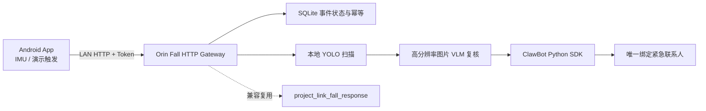

# Android 跌倒守护与 Orin 后端对接 Handoff

验证日期：2026-08-19
Android 分支：`codex/android-fall-guard-mvp`
Android 实现基线：`fec990d`（本 handoff 之前的应用代码）
Android 工程：`apps/project_link_fall_android/`

## 当前结论

手机端 MVP 已完成，Orin 静态无运动后端已在 `main` 工作树实现，等待 Orin
构建、模型安装、微信绑定和端到端验收。当前 App 支持：

- 真实模式：前台服务以约 50 Hz 读取加速度计、陀螺仪和旋转矢量，生成疑似跌倒事件。
- 演示模式：强确认后倒计时 5 秒，不伪造 IMU 数据，直接提交演示事件。
- 事件提交后每秒查询一次 Orin 状态，并提供 15 秒“我没事”取消窗口。
- 本地模拟后端完整覆盖 `accepted -> scanning -> verifying -> notified`。
- 固定共享 Token、相同 `event_id` 重试和 60 秒网络重试已在客户端实现。

已在小米 `2304FPN6DC`、Android 16 / API 36 真机安装并冷启动。用户已手工确认设置、模式切换、开始守护和演示相关按钮均可操作。Windows 构建、单元测试、Lint 和仪器测试编译通过。一次 `connectedDebugAndroidTest` 在执行期间发生 ADB 重连，因此不能将该次自动化结果记为通过；这不影响手工真机验收。

尚未验证：真实人体跌倒数据、锁屏长时间采样、MIUI 电池优化、真实 Orin HTTP 服务和真实联系人通知。禁止通过人员真实摔倒完成校准。

## 系统边界



- 手机只负责触发、取消和显示状态，不直接访问摄像头、ROS 2、YOLO、VLM 或 ClawBot。
- Orin 独占摄像头、ROS 2、机器人控制和通知凭据。
- HTTP Gateway 不得直接发布 `/cmd_vel`。后续视觉扫圈必须调用受控的导航/底盘 Action，并遵守全系统只有一个 `/cmd_vel` 所有者的规则。
- 第一轮 HTTP 联调不得启用底盘运动；先用静态画面或模拟阶段跑通手机到 Orin。
- 手机触发不依赖唤醒词、声源定位或用户跌倒后再次说话。

## Android 已实现的 HTTP 契约

默认建议监听：`0.0.0.0:8765`。手机设置中填写 `http://<orin-lan-ip>:8765`。

所有请求包含：

```http
Accept: application/json
X-Fall-Guard-Token: <shared-token>
```

POST 请求还包含：

```http
Content-Type: application/json; charset=utf-8
```

共享 Token 存在 Orin 的 mode-0600 环境文件中，不写入仓库、ROS 消息或普通日志。MVP 允许局域网 HTTP；正式部署再升级到 HTTPS、VPN 或隧道。

### `GET /health`

客户端只要求返回任意 `2xx`，推荐响应：

```json
{
  "status": "ok",
  "service": "project-link-fall-gateway",
  "notification_ready": true,
  "vision_ready": true
}
```

健康检查不得触发摄像头、机器人运动或通知。

### `POST /api/fall`

真实模式请求：

```json
{
  "event_id": "8e4a1828-b929-4bdf-a80e-f8d4a019f759",
  "mode": "real",
  "occurred_at_ms": 1787131200000,
  "device_name": "demo-phone",
  "cancel_window_ms": 15000,
  "imu": {
    "peak_accel_g": 2.8,
    "orientation_change_deg": 63.0,
    "inactivity_ms": 2200
  }
}
```

演示模式固定为：

```json
{
  "event_id": "8e4a1828-b929-4bdf-a80e-f8d4a019f759",
  "mode": "demo",
  "occurred_at_ms": 1787131200000,
  "device_name": "demo-phone",
  "cancel_window_ms": 15000,
  "imu": null
}
```

服务端要求：

- `event_id` 是全链路幂等键。首次请求创建事件；重复请求返回已有事件，绝不能重新扫描或重复通知。
- 新事件返回 `202`，重复事件返回 `200`；客户端接受所有 `2xx`。
- `occurred_at_ms` 只作为展示元数据，不作为安全计时来源。
- 服务端收到请求时记录自己的 `received_at`，并计算 `notify_not_before = received_at + cancel_window_ms`。
- `cancel_window_ms` 当前只接受 `15000`；其他值返回 `400`，避免客户端和服务端倒计时不一致。
- `mode=demo` 只供内部日志和测试统计使用。根据现场演示要求，最终发给紧急联系人的正文不增加“演示”标记。

推荐响应：

```json
{
  "event_id": "8e4a1828-b929-4bdf-a80e-f8d4a019f759",
  "status": "accepted",
  "message": "event persisted"
}
```

### `GET /api/fall/{event_id}`

客户端约每秒查询一次，只读取顶层 `status`：

```json
{
  "event_id": "8e4a1828-b929-4bdf-a80e-f8d4a019f759",
  "status": "verifying",
  "message": "VLM secondary assessment in progress",
  "updated_at_ms": 1787131208000
}
```

允许状态只有：

| 状态 | 含义 |
| --- | --- |
| `accepted` | 事件已持久化，尚未开始或正在预检。 |
| `scanning` | 正在获取现场画面或运行本地 YOLO。 |
| `verifying` | 已有候选目标，正在执行高分辨率图片 VLM 复核。 |
| `notified` | ClawBot 已确认通知发送成功。 |
| `not_fall` | 视觉判断未发现可信跌倒。 |
| `cancelled` | 在通知副作用发生前成功取消。 |
| `failed` | 处理失败，且不会发送联系人通知。 |

状态只能单向前进。`notified`、`not_fall`、`cancelled` 和 `failed` 是终态，进程重启后也不得改变。

### `POST /api/fall/{event_id}/cancel`

请求体固定为 `{}`。

- 已知且仍可取消：原子地写入 `cancelled`，停止未完成的扫描、VLM 和通知任务，返回 `200` 和 `status=cancelled`。
- 已知但通知已经开始或已经结束：返回 `200` 和真实当前状态，例如 `notified`；不要用 `409`，客户端会直接展示响应状态。
- 未知 ID：返回 `404`。
- 取消和通知发送之间必须由同一个事务/锁裁决，保证不出现接口返回 `cancelled` 后仍发送消息。

当前 Android 客户端对“取消请求发生传输异常”的展示仍偏乐观，可能暂时显示为已取消。真实通知联调前应将其改为失败关闭：只有服务端明确返回 `cancelled` 才显示取消成功。这是 App 侧 P0 集成门槛。

## Orin 后端实现要求

### 1. HTTP Gateway 与事件持久化

建议在 `project_link_fall_response` 中新增独立 Python 可执行程序 `fall_http_gateway`，使用 FastAPI + Uvicorn，ROS executor 放在独立线程。不要把 HTTP 请求线程直接阻塞到整个视觉流程结束。

使用 Python 标准库 `sqlite3` 持久化事件，建议位置：

```text
~/.local/state/project-link/fall-response/events.sqlite3
```

最少字段：

- `event_id` 主键
- `mode`
- `device_name`
- `occurred_at_ms`
- `received_at_ms`
- `notify_not_before_ms`
- `status`
- `message`
- `ros_goal_id` 或内部任务 ID
- `notification_attempted_at_ms`
- `notification_succeeded_at_ms`
- `created_at_ms`、`updated_at_ms`

Gateway 重启后：终态原样恢复；非终态统一恢复为 `failed`，MVP 不自动重新启动机器人扫描或通知。手机可查询到明确失败，但不会产生重复副作用。

### 2. 与现有 ROS 跌倒模块的关系

仓库已有：

- `/front_camera/capture_still`
- `/fall_detection/assess_fall`
- `/fall_detection/confirm_alert`
- OpenAI-compatible VLM 严格 JSON 解析；端点与模型由 `.env` 配置
- 飞书 webhook 通知适配器

现有 `AssessFall` 是为“唤醒词 + 声源转向 + 语音确认”设计的，不能原样暴露给手机：它会发布 TTS，并在视觉确认后重新开始一个 15 秒语音确认窗口。手机事件的取消窗口从 HTTP 接收时开始，且不依赖语音。

实现时应提取并复用现有相机抓拍、VLM 解析和通知核心代码，新增手机事件协调器；不要让 HTTP Gateway 通过伪造语音确认去套用旧流程。`AssessFall` 的语音调用方式必须保持兼容。

HTTP 到内部阶段的建议映射：

| HTTP 状态 | 内部动作 |
| --- | --- |
| `accepted` | SQLite 写入成功，Token 和请求校验通过。 |
| `scanning` | 静态抓拍或受控扫圈，本地 YOLO 推理。 |
| `verifying` | 保存/选取高分辨率 JPEG，调用 VLM。 |
| `not_fall` | YOLO/VLM 未达到可信阈值。 |
| `notified` | 已过 `notify_not_before`，ClawBot SDK 返回成功。 |
| `failed` | 相机、模型、ROS、通知或持久化失败。 |

### 3. 摄像头和视觉流程

生产只允许使用 canonical alias：

- `/dev/project_link_front_camera`：车体前向预览和跌倒扫描候选相机。
- `/dev/project_link_arm_camera`：机械臂/视觉抓取相机，手机跌倒 MVP 默认不占用。

现有 fall-response 配置中的 `/dev/FallCam` 和文档中的 `/dev/RgbCam` 是旧名字，接入前必须迁移，禁止改成 `/dev/videoN`。

分两步联调：

1. HTTP 首通：不动车，前向相机单帧或固定测试图，直接模拟/执行 `scanning -> verifying`。
2. 完整流程：受控转一圈，本地 YOLO 快速筛选候选帧，选择最高可信候选的高分辨率 JPEG 交给 VLM。

本地 YOLO 不直接发送告警，只负责快速否决或选择候选帧；最终联系人通知必须由 VLM 复核结果和阈值共同决定。具体 YOLO 跌倒模型仍需选型和实测，不在 Android 交付范围内。

任何扫圈运动都必须：

- 由独立受控 ROS Action 所有，不由 HTTP 代码发布 `/cmd_vel`。
- 开始前确认当前不存在 Nav2/遥控等其他速度所有者。
- 收到取消、Action 失败、超时、网络进程退出时停止并输出零速度。
- 首次硬件验证前由用户清场并准备物理急停。

### 4. ClawBot 通知

目标通知通道是微信 **ClawBot**，使用 `corespeed-io/wechatbot` 的 Python SDK，不引入 Node.js。只绑定一个紧急联系人。

封装统一接口：

```python
class EmergencyNotifier:
    def send_fall_alert(self, event_id: str, image_path: str, summary: str) -> NotificationResult:
        ...
```

要求：

- 扫码登录属于用户动作，首次部署时单独完成。
- SDK 登录态、账号信息、`context_token` 和联系人绑定必须持久化，默认目录：
  `~/.local/state/project-link/clawbot/`，文件权限 0600。
- 每个 `event_id` 最多发送一次。通知前先在 SQLite 中原子领取发送权，成功后记录回执。
- 建议发送一条文字和一张最终高分辨率图片；不得发送连续扫圈的全部帧。
- 最终消息不标记 demo/real；事件模式只留在 Orin 本地审计日志中。
- SDK 不可用、登录态过期或发送失败时状态必须是 `failed`，不能伪报 `notified`。
- 现有飞书 webhook 保留为显式配置的 fallback adapter，但默认一次事件只选择一个通知通道，不同时重复发送。

## 安全和并发约束

- MVP 同时最多处理一个非终态跌倒事件。第二个新 `event_id` 返回 `503`；相同 ID 仍返回原事件。
- Token 不匹配返回 `401`，日志只记录来源 IP 和结果，不记录 Token。
- JSON 缺字段、类型错误、未知 mode/status 返回 `400`。
- 限制请求体大小，例如 16 KiB；手机不会上传原始 IMU 流或图片。
- `cancel_window_ms` 到期不代表必须通知，只代表在视觉确认为跌倒时允许通知。
- 无可信跌倒必须进入 `not_fall`，不能为了演示效果强制发送。
- `notified` 只表示 SDK 明确成功，不表示仅仅“已经尝试”。

## 后端测试与验收顺序

1. 纯 HTTP 假流程：手机关闭本地模拟，测试连接和四个端点。
2. 幂等：同一 `event_id` 连续 POST 10 次，只创建一个事件。
3. 取消竞态：在 14.9 秒取消，不发送通知；取消和发送并发时只能有一个终态。
4. 进程恢复：Gateway 在 `verifying` 时重启，恢复为 `failed`，不自动通知。
5. 静态视觉：固定测试图片分别得到 `not_fall` 和可信跌倒结果。
6. ClawBot 沙盒联系人：确认文字、单张图片、持久登录和 exactly-once。
7. 手机演示模式全链路：5 秒倒计时、15 秒取消、最终状态显示。
8. 手机真实模式：只用受控手机轨迹或软垫测试，不要求人员真实摔倒。
9. 最后才启用底盘扫圈，并执行物理安全检查。

最小 `curl` 首通：

```bash
export FALL_TOKEN='<shared-token>'

curl -H "X-Fall-Guard-Token: ${FALL_TOKEN}" \
  http://127.0.0.1:8765/health

curl -X POST \
  -H "X-Fall-Guard-Token: ${FALL_TOKEN}" \
  -H 'Content-Type: application/json' \
  http://127.0.0.1:8765/api/fall \
  -d '{
    "event_id":"00000000-0000-0000-0000-000000000001",
    "mode":"demo",
    "occurred_at_ms":1787131200000,
    "device_name":"backend-smoke",
    "cancel_window_ms":15000,
    "imu":null
  }'
```

## 剩余 Gate

- P0：在 Orin 普通 colcon 构建并执行 HTTP/SQLite/ROS 自动化测试。
- P0：安装固定版本 ClawBot Python SDK，完成扫码登录和唯一联系人绑定。
- P0：安装并记录 `yolov8n-pose.pt` 的 SHA-256，验证五帧静态推理。
- P0：手机与真实 Orin 联调 Token、幂等、状态轮询和取消竞态。
- P1：验证确认告警与视觉失败降级告警的微信文字/图片结果。
- P2：在单一 `/cmd_vel` 所有权下实现可取消的受控视觉扫圈。

相关文档：

- Android 工程说明：`apps/project_link_fall_android/README.md`
- 旧语音触发契约：`docs/modules/sensors/fall-response/VOICE_INTEGRATION.md`
- 系统硬件和安全边界：`AGENTS.md`
